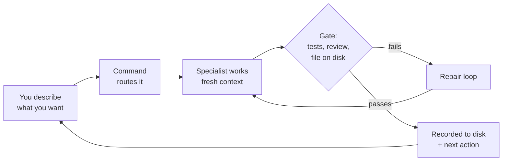

# Godpowers

[](https://github.com/hannsxpeter/godpowers/actions/workflows/ci.yml)
[](LICENSE)
[](CHANGELOG.md)
[](https://www.npmjs.com/package/godpowers)

### Your AI writes code fast. Godpowers makes it accountable.

**Ship fast. Ship right. Ship everything. Ship accountably.**

Godpowers turns your AI coding assistant into a disciplined engineering team:
a product manager, an architect, a builder, and two independent reviewers who
check the builder's work. You describe what you want in plain English. It plans
the project, does the work, tests it, reviews it, and writes down what happened
so you can see it, question it, and pick it back up tomorrow.

It is free, open source, and installs in one line.

```bash
npx godpowers --claude --global --profile=core
```

---

## Why this exists

AI coding tools are astonishingly fast and quietly unreliable. Anyone who has
used one for real work knows the pattern:

- It says "done" when it is not done.
- It writes code that runs but does not do what you asked.
- It forgets what you decided three messages ago.
- It cheerfully approves its own work.
- Two weeks later, nobody can explain why the project is shaped the way it is.

The problem is not the model. The problem is that a chat window has no memory,
no standards, and no referee. Godpowers adds all three.

| Working with AI alone | Working with Godpowers |
|---|---|
| Decisions live in a chat log you will never scroll back through | Decisions live in files on disk, in plain language |
| "Done" means the AI said so | "Done" means tests passed, review passed, and the file exists |
| The same AI writes and approves the work | The writer never grades its own work; a separate reviewer does |
| Start a new session, lose the thread | Open any session, ask what is next, get a real answer |
| Generic output that could describe any product | Every document is checked for generic filler and rejected if found |

---

## What you get at the end of a run

Not just code. A project someone else could pick up:

- **A plan you can read.** What the product is, who it is for, what counts as done.
- **A record of the hard calls.** Which options were considered, which one won, and why.
- **Code with tests.** Written test-first, not bolted on afterward.
- **A security pass.** Known critical issues block the launch instead of shipping with it.
- **A next action.** Always. Godpowers reads the project from disk and tells you the next move.

---

## See it work in about a minute

You do not have to install anything, and this changes nothing on your computer.
Open a terminal in any project folder and run:

```bash
npx godpowers quick-proof --project=. --brief
```

That prints a complete worked example from a bundled sample project, plus an
honest report of what your setup can and cannot do. It does not read your code
and it does not write any files.

Want it to look at your actual project instead? Same read-only view, pointed at
your code:

```bash
npx godpowers quick-proof --project=. --inspect-project --brief
```

If you like what you see, install it.

---

## Install

One line, for Claude Code:

```bash
npx godpowers --claude --global --profile=core
```

Using something else? Swap the flag: `--codex`, `--cursor`, `--windsurf`,
`--opencode`, `--gemini`, `--copilot`, `--augment`, `--trae`, `--cline`,
`--kilo`, `--antigravity`, `--qwen`, `--codebuddy`, `--pi`. Or `--all` to cover
every tool you have.

The installer drops a set of commands and specialist definitions into your AI
tool's config folder. Nothing runs in the background, and nothing phones home.

### Your first three commands

Open your AI tool inside a project and type one of these. (A "slash command" is
just a shortcut you type into the chat box, like `/god`.)

```
/god         describe what you want in plain English and it routes you
/god-mode    run the whole project, idea to hardened production, on its own
/god-loop    set up a self-driving loop that keeps working on a schedule
```

If you only ever remember one, remember `/god`. Tell it what you want and it
figures out which of the specialists to bring in.

### Pick a profile so the command list stays calm

You do not need all 124 commands visible at once. A profile installs only the
ones that match how you work:

| If this sounds like you | Use this profile |
|---|---|
| I just want the basics | `core` |
| I build products | `builder` |
| I maintain Godpowers or mature repos | `maintainer` |
| I coordinate work across several repos | `suite` |
| Show me everything | `full` |

```bash
npx godpowers --claude --global --profile=core
npx godpowers --codex --local --profile=builder
```

Changed your mind? Switch what is visible without reinstalling:

```bash
npx godpowers surface --profile=builder --codex --global --dry-run
npx godpowers surface --profile=builder --codex --global --apply
```

`--minimal` is another name for `--profile=core`.

### Runtime Expectations

Godpowers relies on your AI tool to run its specialist workers, and tools differ
in what they can do. Rather than pretending everything worked, it tells you
plainly which guarantees it can offer: **full**, **degraded**, or **unknown**.

| Your tool | What to expect |
|---|---|
| Claude Code | Best supported. Everything described here works. |
| Codex | Strong support through installed agent metadata. |
| Other install targets | Commands and specialist definitions install; how much runs natively depends on the tool. |
| Degraded hosts | Godpowers says so out loud instead of hiding it. |

Details: [Host capabilities](https://github.com/hannsxpeter/godpowers/blob/main/docs/host-capabilities.md).

---

## Who this is for

You do not have to be a senior engineer. You do have to be willing to read what
the AI wrote and say yes or no.

| You are | Godpowers gives you |
|---|---|
| A founder or solo builder | A whole team's worth of roles without hiring one |
| A small engineering team | Consistent standards nobody has to police by hand |
| A technical lead | A paper trail: what was decided, by whom, and on what evidence |
| An agency or consultancy | Handoff-ready projects a client's team can actually inherit |
| Product-minded but not a coder | Plain-language plans you can review, and pauses when your judgment is required |

---

## How it works, in three steps

**1. You say what you want.** Plain English. "Build a booking tool for a dance
studio." No special syntax required.

**2. Godpowers brings in the right specialist.** Each command is a receptionist,
not a worker. It hands the job to a specialist who starts with a clean head and
one clear task: a product manager writes the plan, an architect decides the
shape, a builder writes code, and two reviewers check it.

**3. Nothing counts as done until it passes.** Tests run. A second reviewer
grades the work. The file has to actually exist on disk. Then, and only then,
Godpowers writes down what happened and tells you what is next.



Notice that the arrow from the gate loops *backwards* on failure. Work does not
proceed past a gate it did not clear; it goes back and gets fixed.

Here is a real command, start to finish:

```
You type:        /god-prd
Skill loads:     skills/god-prd.md
Skill spawns:    god-pm agent (fresh context)
Agent reads:     .godpowers/state.json + .godpowers/intent.yaml
Agent writes:    .godpowers/prd/PRD.mdx
Skill verifies:  artifact exists, have-nots pass
Skill updates:   state.json
```

### The maker is never the checker

This is the single most important rule in Godpowers. The specialist who writes a
change never grades it. The reviewer is spawned separately, with no memory of
writing the thing it is reviewing, so it cannot rubber-stamp its own work.
Building, checking against the spec, and checking code quality are three
independent jobs done by three independent workers.

---

## Start with a path

The full toolkit is large. You do not need it. Pick one path below, run the
first command, and learn the next one only when Godpowers recommends it.
`/god-help` shows a short view based on where your project actually is;
`/god-help all` shows everything.

### Start With A Path

| Goal | Starter path |
|---|---|
| Start a product | `/god-first-run`, `/god-init`, `/god-plan`, `/god-build` |
| Try safely | `/god-demo`, `/god-first-run`, `/god-init` |
| Add a feature | `/god-reconcile`, `/god-feature`, `/god-sync`, `/god-review` |
| Fix production | `/god-fix`, `/god-postmortem`, `/god-status` |
| Audit an existing repo | `/god-preflight`, `/god-archaeology`, `/god-reconstruct`, `/god-audit`, `/god-tech-debt` |
| Ship a release | `/god-ship`, `/god-sync`, `/god-docs`, `/god-version`, `npm run release:check` |
| Maintain project health | `/god-hygiene`, `/god-update-deps`, `/god-docs`, `/god-check-todos` |
| Extend Godpowers | `/god-extend scaffold --name=@godpowers/my-pack --output=.`, `/god-extend test`, `/god-extend add`, `/god-extend list` |

New public command surface should be added only when existing families, ladders,
profiles, recipes, and docs cannot express a proven user need.

### Do not want full autonomy?

Then do not use it. Run one command at a time. After each one, Godpowers tells
you what to run next, and you can always ask:

```
/god-next
```

It reads the project state from disk, checks whether reality has drifted from
the plan, and suggests the next logical step with a short brief. In Claude Code
it does this automatically when you open a session in a Godpowers project.

---

## Two ways to drive

**One-shot arc.** Type `/god-mode` and Godpowers runs the whole project from
idea to hardened production, stopping only when it hits a question only you can
answer. Best for building something once.

**Standing loop.** Type `/god-loop` and Godpowers sets up a self-driving cycle on
a schedule: it wakes up, finds the next piece of work, does it, checks it, writes
down what happened, and decides what to do next. Best for ongoing work such as
nightly cleanup, a backlog that drains itself, or an issue queue that triages
itself.

### The loop, explained

Loop engineering is the shift from prompting an AI by hand to building a small
system that prompts it for you. A loop has exactly four moving parts, and
`/god-loop` wires them up in order:

1. **A heartbeat.** A schedule or trigger decides when the loop wakes up.
2. **A unit of work.** One Godpowers command per tick. That is the job.
3. **A memory.** Files on disk let the loop resume where it left off instead of
   starting over every time.
4. **A brake.** An automatic pass-or-fail check that a change must clear before
   it is accepted. A loop without a brake quietly ships half-finished work, so
   `/god-loop` refuses to build one without a hard stop.

### Is the loop actually working?

One number tells you: the **accepted-change rate**. Of the changes the loop
proposed, what fraction survived the check instead of being rejected or rolled
back? Healthy loops stay above 50 percent.

```
/god-metrics        accepted-change rate plus per-stage stats
```

The number is computed from the event log, not self-reported, so it cannot be
flattered.

### Letting the loop touch the outside world

A loop that only reads its own notes is half a loop. `/god-connect` lets it open
a GitHub issue, move a Linear ticket, post to Slack, or triage a Sentry error,
by handing the job to connectors your AI tool already has. Godpowers never
stores or handles your credentials; it only names the connector and the action.

Reading is allowed by default. **Writing is off until you turn it on**, one
connector at a time:

```
/god-connect                 see which connectors exist and what they can do
/god-connect allow github    let it write to GitHub
```

### Keeping it safe over time

An unattended loop quietly accumulates permissions. `/god-harden` tracks a
**permission re-audit cadence** (every 30 days by default), so you get a firm
signal when connector access and credentials are due for review, instead of a
vague sense that someone should check security sometime.

---

## How it stays honest

Every document and every change clears these automatic checks before it counts:

| Check | What it catches |
|---|---|
| Substitution test | Generic filler that would read the same for any product |
| Three-label test | Guesses quietly presented as decisions |
| Have-nots | A named list of known failure modes, checked mechanically |
| Artifact-on-disk | The AI claiming "done" when the file was never written |
| Critical-finding gate | Shipping with a known security hole |
| TDD enforcement | Code without tests |
| Two-stage review | Code that passes tests but breaks the spec or the standards |
| Accepted-change rate | A loop spinning instead of shipping |

**These are guardrails, not proof you built the right thing.** A plan can pass
every check and still be the wrong plan. The point is to eliminate generic,
missing, and untraceable work, so that whatever human judgment is left is
visible and yours to make.

### It writes things down where you can find them

Godpowers keeps its work in a `.godpowers/` folder inside your project, in files
you can open and read. Not in chat history. Not in a database. Not in a cloud
account. If you delete the folder, you have deleted the memory, and nothing else
breaks.

### It picks up where other tools left off

If your project already has planning or audit output on disk, Godpowers imports
it instead of asking you to type it in again.

| If your project already has | Godpowers does this |
|---|---|
| A plan from [godplans](https://github.com/hannsxpeter/godplans), a companion tool that decides a project's architecture, roadmap, and tasks before any code is written | Imports the plan and its tasks rather than re-planning |
| A report from [godaudits](https://github.com/hannsxpeter/godaudits), a companion tool that scores a finished codebase and lists what is wrong | Turns each open finding into a tracked task |
| Artifacts from Arc-Ready, an earlier tier-based workflow | Reads them as migration evidence and writes progress back to one sync file |

None of these is required. They are separate projects, and a run that finds none
of them behaves exactly the same, minus the import.

---

## The words you will see

Godpowers has its own vocabulary. Here is what each term means, in plain English:

- **arc** - one full run of a project, from raw idea to launch.
- **tier** - a phase of that run. There are four: orchestration, planning,
  building, shipping.
- **agent** - a specialist worker (a product manager, an architect, a reviewer)
  brought in with a clean head to do one job well.
- **skill / slash command** - something you type, like `/god-build`. There
  are 124 of them, and you only ever need a few at a time.
- **gate** - an automatic pass-or-fail check that work must clear before it
  counts as done. No gate, no "done".
- **have-nots** - a named list of failure modes every document must avoid.
  They are checked by machine, so they cannot be faked.
- **loop** - a self-driving cycle: find work, do it, check it, record it, decide
  the next move.
- **state** - the project's memory, kept in files inside `.godpowers/`, never
  trapped in a chat window.

You do not need to memorize any of this. `/god-help` explains things in context,
and the full list lives in
[docs/concepts.md](https://github.com/hannsxpeter/godpowers/blob/main/docs/concepts.md).

---

## Under the hood

Skip this section if you do not want it. Nothing below is required to use
Godpowers.

### The four tiers

| Tier | Sub-steps | Specialists |
|------|-----------|-------------|
| 0: Orchestration | mode detection, scale, progress | god-orchestrator |
| 1: Planning | PRD, optional DESIGN, ARCH, ROADMAP, STACK | god-pm, god-designer, god-architect, god-roadmapper, god-stack-selector |
| 2: Building | repo, plan, execute, review | god-repo-scaffolder, god-planner, god-executor, god-spec-reviewer, god-quality-reviewer |
| 3: Shipping | deploy, observe, launch, harden | god-deploy-engineer, god-observability-engineer, god-launch-strategist, god-harden-auditor |

### What is in the box

The source contains 124 slash commands, 41 specialist agents,
13 workflows, and 45 recipes. The default `core` profile shows you 15 commands.

Under those numbers, a few ideas do the heavy lifting:

- **Project truth lives in files.** A root `AGENTS.md` plus routed `agents/*.md`
  notes (one per area: auth, data, deploy, and so on) record what is true about
  your project. A command loads only the notes its task needs. That layout
  follows [Pillars](https://github.com/hannsxpeter/pillars), an open convention
  so any AI tool can find them.
- **Form-first execution.** One primary product form picks the working approach
  before industry and regulatory constraints get layered on.
- **Fresh-context workers in parallel.** Specialists run side by side with
  atomic commits. No degraded memory, no single-file bottleneck.
- **Publication integrity.** Going public is tied to a fresh security hash, a
  timestamp, and a policy on critical findings.

### The optional MCP companion

The main runtime has no dependencies. A separate `@godpowers/mcp` package
exposes nine read-only tools (`status`, `next`, `gate_check`, `lint_artifact`,
`trace_requirement`, `work_report`, `change_metrics`, `route`,
`verification_history`) so compatible tools can read project state:

```bash
npx godpowers mcp-info --project=.
npx -y -p godpowers@5.0.0 -p @godpowers/mcp@5.0.0 godpowers-mcp serve --project=.
```

Registering it with a host is opt-in:

```bash
npx -y -p godpowers@5.0.0 -p @godpowers/mcp@5.0.0 godpowers-mcp setup --host=codex --project=. --write
```

Actions that change anything outside your project never go through this surface.
They are delegated to host connectors via `/god-connect`. See
[MCP Companion](https://github.com/hannsxpeter/godpowers/blob/main/docs/mcp.md).

---

## What it costs, and when it stops to ask

A full autonomous run brings in many specialists and can get expensive.
Godpowers tracks token and dollar estimates as it goes. `/god-cost` reports what
you spent and what caching saved you; `/god-budget` sets limits before you start.

It pauses only when a human is genuinely required:

1. What you asked for could reasonably mean two different things.
2. A hard-to-reverse decision depends on things it cannot know (your team size,
   your budget).
3. Two options score within 10 percent of each other with no objective tiebreak.
4. A critical security finding needs your judgment.
5. Brand or copy decisions need your voice.

Every pause states the question, why only you can answer it, the options with
their tradeoffs, and what it will do by default if you just say "go". Ordinary
failures are not pauses; it fixes those itself.

---

## Honest limits

Things Godpowers does not claim to do:

- It does not know whether your product idea is good. It checks that your plan
  is specific and traceable, not that it is correct.
- It does not replace a security team. `/god-harden` catches known classes of
  problem and blocks on critical findings; it is not a penetration test.
- It does not run the same everywhere. On tools without native agent support,
  it says so instead of pretending.
- It does not remove the need to read what it wrote. The paper trail exists so
  you can check the work, which only helps if you check it.

---

## Supported tools

Installs for 15 runtimes: Claude Code, Codex, Cursor, Windsurf, Gemini CLI,
OpenCode, Copilot, Augment, Trae, Cline, Kilo, Antigravity, Qwen, CodeBuddy, Pi.
Claude Code and Codex are the best-supported paths; on other tools the commands
and specialist definitions install, but how much runs natively depends on the
tool.

## For maintainers

The public release gate is one command:

```bash
npm run release:check
```

`npm test` runs the full suite through `scripts/run-tests.js`, and `npm run lint`
runs dependency-free static checks.

## Full reference

- [Getting Started](https://github.com/hannsxpeter/godpowers/blob/main/docs/getting-started.md)
- [Concepts](https://github.com/hannsxpeter/godpowers/blob/main/docs/concepts.md)
- [Loop engineering](https://github.com/hannsxpeter/godpowers/blob/main/docs/loop-engineering.md)
- [Quick Proof](https://github.com/hannsxpeter/godpowers/blob/main/docs/quick-proof.md)
- [First 10 Minute Proof Case Study](https://github.com/hannsxpeter/godpowers/blob/main/docs/case-studies/first-10-minute-proof.md)
- [Adoption Canary](https://github.com/hannsxpeter/godpowers/blob/main/docs/adoption-canary.md)
- [Command reference (all 124 skills + 41 agents)](https://github.com/hannsxpeter/godpowers/blob/main/docs/reference.md)
- [Host capabilities](https://github.com/hannsxpeter/godpowers/blob/main/docs/host-capabilities.md)
- [Roadmap](https://github.com/hannsxpeter/godpowers/blob/main/docs/ROADMAP.md)
- [Release Notes](RELEASE.md)
- [Changelog](CHANGELOG.md)
- [Inspiration](INSPIRATION.md)

## License

MIT
