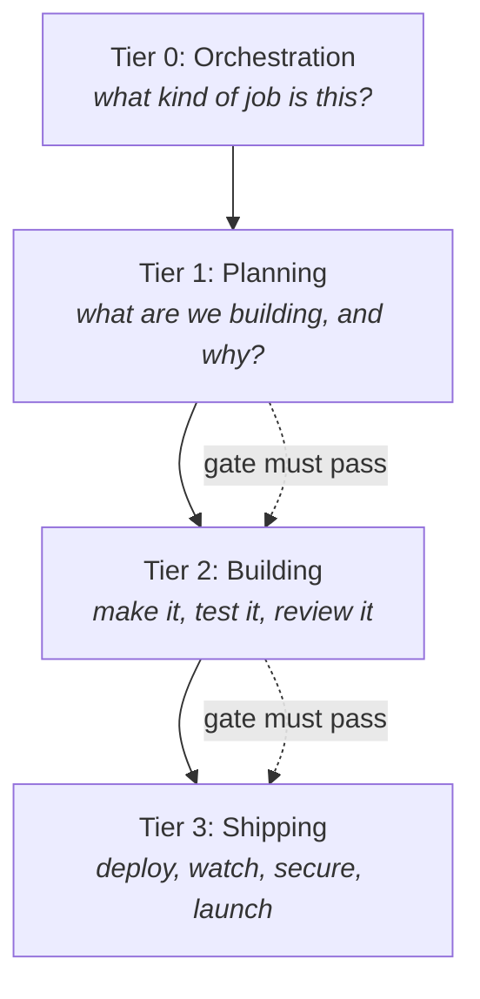

# Godpowers Concepts

This page explains how Godpowers thinks, so its output makes sense to you.

You can use Godpowers without reading any of it. But if you have ever wondered
why it refused to call something done, or why it spawned a second reviewer to
check the first one, the answers are here.

Four ideas carry most of the weight: **one boss**, **four stages**,
**specialists**, and **checks that cannot be talked out of**.

---

## One boss, and only one

Godpowers has exactly one thing in charge: an orchestrator called
`god-orchestrator`. Think of it as a quarterback. It reads the situation, calls
the play, owns the playbook, and manages the clock. Every other worker is
brought in by it, does one job, and leaves.

This matters more than it sounds. The most common way these systems fail is
having two things that both believe they are in charge, which produces
contradictory decisions nobody can trace.

Three commands sit on the sideline. They read the playbook but never call a
play:

| Command | What it does |
|---|---|
| `/god` | The front door. You describe what you want; it works out which command you actually need. |
| `/god-next` | Checks whether you are ready for the next step, and tells you what it is. |
| `/god-status` | Re-reads the project from disk and reports anything that does not add up. |

None of these three can change anything. They only read and suggest. The
orchestrator, and the specialists it brings in, are the only writers.

**Why no boss above the boss?** Stacking orchestrators is a known trap. As soon
as you have two, it becomes unclear who owns the project state, who decides when
to stop and ask a human, and whose error message you should believe. If
Godpowers ever needs coordination across several repositories at once, that goes
in as a *peer* at the same level (`god-coordinator`), never as a layer on top.

### Families and ladders

Commands are grouped into **families** so the list stays scannable: start,
continue, build, verify, operate, maintain, capture, recover, extend,
collaborate, and configure. Every individual command still works as a direct
shortcut; families are just a nicer way to find them.

Some families are **ladders** rather than flat lists, because the right choice
depends on size. Capture routes you to a note, a todo, a backlog item, or a
seed. Build routes by how big the job is, from fast to hotfix. Verify climbs
from the cheapest possible check to a full release rehearsal.

---

## Four stages

A project runs through four stages, called **tiers**. Each has sub-steps, and
each sub-step has one command and one specialist behind it.

| Tier | Sub-steps |
|------|-----------|
| 0: Orchestration | mode detection, scale detection |
| 1: Planning | PRD, ARCH, Roadmap, Stack |
| 2: Building | Repo, Build |
| 3: Shipping | Deploy, Observe, Launch, Harden |



Each sub-step depends on the one before it. You cannot run `/god-arch` until
`/god-prd` has passed. This is deliberate: designing a system before anyone has
written down what it is for is how projects end up solving the wrong problem
very elegantly.

---

## Skills and agents: the receptionist and the specialist

Two words that sound similar and are not:

- A **skill** is the slash command you type. It is thin. It does almost nothing.
- An **agent** is the specialist that does the actual work. It is deep.

Here is the handoff in full:

- You type `/god-prd`. That is the skill.
- The skill brings in `god-pm`, an agent, with a completely fresh memory.
- `god-pm` reads the project state and writes the plan document.
- The skill checks the file really exists and passes its quality checks, then
  records what happened.

**Why a fresh memory every time?** Because long conversations decay. Details
from twenty messages ago get fuzzy, contradicted, or silently dropped. Giving
each specialist a clean window containing only what its job requires means the
quality of its work does not depend on how long you have been chatting.

---

## Checks that cannot be talked out of

This is the part that makes Godpowers different from asking an AI nicely to do
a good job.

### The substitution test

Take a sentence. Swap your product's name for a competitor's. If it still reads
true, the sentence decided nothing and gets rewritten.

Fails the test:

> Our app is the future of project management.

"The future of project management" works equally well for any product in the
category. It is a sentence shaped like a claim that contains no claim.

Passes the test:

> Solo SaaS founders running between $1k and $10k MRR cannot decompose revenue
> change between new customers and price increases.

You cannot swap another product in without breaking the meaning, because the
sentence is about something specific and real.

### The three-label test

Every sentence in a Godpowers document must be exactly one of three things:

- `[DECISION]` - a choice that was made, with the reasoning attached
- `[HYPOTHESIS]` - an assumption, with a plan for testing whether it holds
- `[OPEN QUESTION]` - something unresolved, with an owner and a due date

Anything unlabeled is theater and gets rewritten. The purpose is to stop guesses
from quietly graduating into decisions just because nobody wrote down which was
which.

### Have-nots

A **have-not** is a named, specific way a document can be bad. There are
183 named failure modes. 25 are mechanical (regex-checkable);
the rest need judgment. A few examples:

| Code | The failure |
|---|---|
| P-01 | A problem statement so generic it passes the substitution test |
| A-04 | An architecture decision with no stated point at which you would reverse it |
| DG-01 | A glossary term that does not say which alternative words to avoid |
| B-01 | Code written before its test |
| L-04 | A launch with no source attribution |
| H-07 | A critical security finding recorded with no remediation options |

The full catalog lives in `references/HAVE-NOTS.md`. The mechanical 25 are wired
into `lib/have-nots-validator.js` and enforced by `/god-lint`, which means they
are not opinions. They either pass or they do not.

### Domain precision

When a discussion settles what particular words mean on your project,
`/god-discuss` can write a project glossary: the terms you use, the near-synonyms
to avoid, how they relate, and which ones are still ambiguous. It is background
material for later documents, not a replacement for them.

---

## Three ways to be wrong, three ways to check

Verification runs on three independent axes, because there are three genuinely
different ways a project can be wrong.

| Axis | What it catches | How long it takes |
|---|---|---|
| **Static** | Bad form: missing fields, format violations, document-level have-nots | Under 1 second |
| **Linkage** | Lying: documents that no longer match the code, orphans, unnoticed knock-on effects | Under 5 seconds |
| **Runtime** | Breakage: what the built app actually does when you load it | 30 seconds to 2 minutes |

Static catches sloppiness. Linkage catches documents that have quietly become
fiction. Runtime catches the thing that passes every test and still does not
work. The complete picture is in [validation.md](./validation.md).

---

## What Godpowers keeps on disk

Three files carry the load:

```
.godpowers/intent.yaml             WHAT YOU WANT     you edit this by hand
.godpowers/state.json              WHAT IS RESOLVED  machine-managed
.godpowers/runs/<id>/events.jsonl  WHAT HAPPENED     append-only history
```

Separating these three is a borrowed idea: intent, resolved facts, and an
append-only history is the same split that package managers and tracing systems
landed on, for the same reason. Wishes, facts, and history rot at different
rates and should not share a file.

---

## Workflows: the arc is not just one thing

`/god-mode` is the headline, but real projects arrive in many shapes. 13 core
workflows cover them:

| Workflow | When you want it |
|----------|------------------|
| full-arc | Greenfield, idea to launch |
| bluefield-arc | Greenfield, but constrained by existing organization standards |
| brownfield-arc | Existing codebase, full reverse-engineering |
| feature-arc | Adding a feature to something that exists |
| hotfix-arc | Production is broken right now |
| refactor-arc | Cleanup with no behavior change |
| spike | Time-boxed research |
| postmortem | Investigating after an incident |
| migration-arc | Framework or version migration |
| docs-arc | Documentation work |
| deps-audit | Dependency updates |
| audit-only | Score what exists, build nothing |
| hygiene | Routine health check |

Each is a declarative file in `workflows/` that the orchestrator reads. Story
files (`/god-story`) and multi-repo suites (`/god-suite-*`) layer on top.

---

## Modes: what kind of situation is this?

Godpowers works out the shape of your project from what it finds on disk.

| Mode | The situation |
|------|---------------|
| A | Greenfield: no code, no history, blank slate |
| B | Gap-fill or brownfield: a project exists, its documentation is missing or partial |
| C | Audit only: score what is there, write nothing |
| E | Bluefield: empty directory, but organization standards apply |

Mode D sits at a right angle to the others. It marks a multi-repo suite and adds
`god-coordinator` alongside the orchestrator, regardless of what mode each
individual repo is in.

---

## When it stops to ask you

Five legitimate reasons to interrupt a human:

1. Your intent could mean two different things.
2. A hard-to-reverse decision depends on something only you know.
3. Two options are statistically tied.
4. A critical security finding needs judgment.
5. Brand voice needs to sound like you.

`--yolo` resolves the first four automatically. Critical security findings still
stop and wait. That carve-out is deliberate and not configurable.

---

## Undoing things

Godpowers moves forward and compensates rather than rewinding. Operations are
appended to a log, `/god-undo` reverts them, and anything destructive is moved
to `.godpowers/.trash/` rather than deleted, so it can be recovered.

---

## Extensions

Skill packs are installed from npm and add specialists for particular domains.
They are lazily activated: a pack's files are not loaded until you invoke one of
its commands, so installing several costs you nothing until you use them.

First-party examples:

- `@godpowers/security-pack` - SOC 2, HIPAA, PCI
- `@godpowers/launch-pack` - Show HN, Product Hunt, Indie Hackers, open source
- `@godpowers/data-pack` - ETL, machine learning features, dashboards

To build your own:

```bash
/god-extension-scaffold --name=@scope/pack --output=.
```

That generates the manifest, package, README, skill, agent, and workflow
skeleton.

---

## Some work does not need a specialist

Not everything deserves an agent. Routine, deterministic jobs run as plain local
steps you can watch: syncing checkpoints, keeping repo documentation in step,
detecting what your host can do, running fixtures. Specialists are reserved for
work that genuinely needs judgment, such as reviewing whether documentation has
drifted from reality, or triaging why a test failed.

The dashboard ties this together, reporting progress, the current phase, what to
do next, what your host guarantees, and proactive checks across docs, security,
dependencies, and hygiene.

---

## Living with other AI tools

Godpowers does not assume it is the only workflow tool you have installed. It
keeps its state inside `.godpowers/` and never writes outside it.

`/god-init`, `/god-migrate`, and feature detection will spot planning context
from other systems, including BMAD and Superpowers. Imported context becomes
background material for native Godpowers documents, and `/god-sync` can write
companion files back to the original system, so you are never locked in.

The coexistence rules and migration paths are in
[references/shared/ORCHESTRATORS.md](../references/shared/ORCHESTRATORS.md). For
credit to the prior art that shaped Godpowers, see
[INSPIRATION.md](../INSPIRATION.md).
